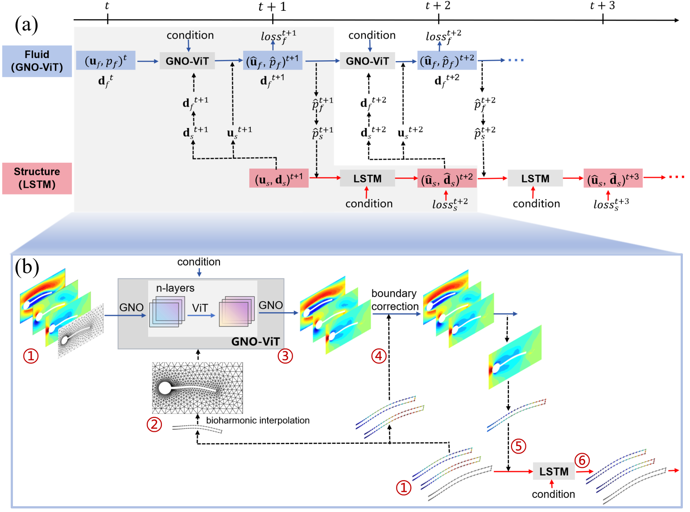
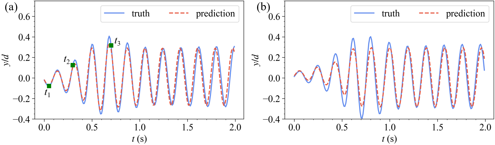
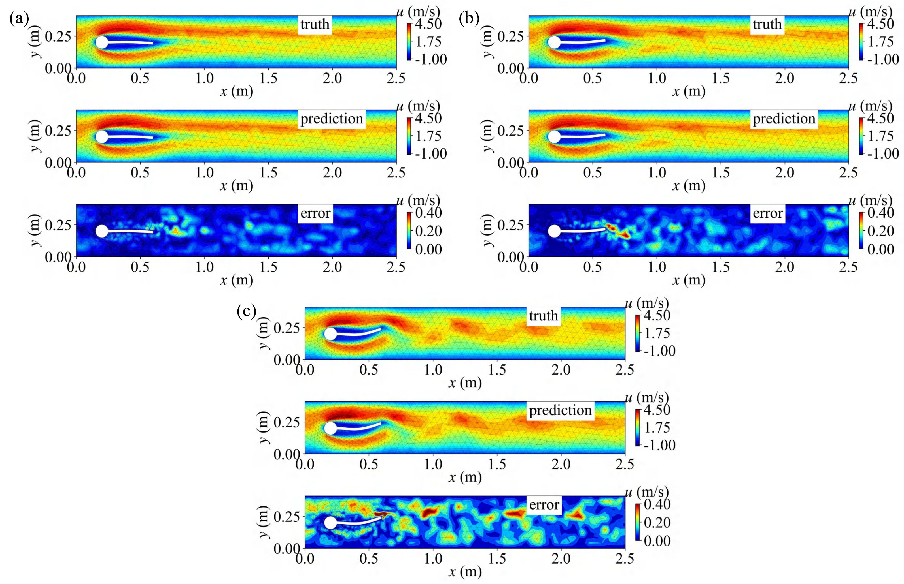
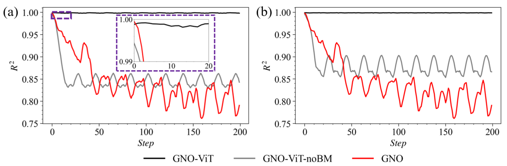

# ALE-Consistent Hybrid Graph Neural Operator-Transformer Framework for FSI Prediction

### Paper

**ALE-Consistent Hybrid Graph Neural Operator-Transformer Framework for Fluid-Structure Interaction Prediction**

by `<Author 1>`, `<Author 2>`, `<Author 3>`

This repository contains the official implementation of the ALE-consistent GNO-ViT framework for long-horizon fluid-structure interaction prediction on deforming unstructured meshes.

## Model Architecture

The framework couples three components:



The fluid surrogate predicts velocity and pressure on the moving mesh. The structural surrogate predicts boundary velocity and displacement. The ALE updater deforms the fluid mesh from the predicted flexible-boundary motion, enabling coupled long-term rollout.

## Representative Results

Non-periodic structural displacement prediction:



Non-periodic flow-field prediction:



Ablation study on long-horizon rollout stability:



More figures extracted from the paper are available in [`figs/`](figs/README.md).

## Setup and Tutorials

Clone the project:

```bash
git clone https://github.com/hunger-233/ale-gno-vit-fsi.git
cd ale-gno-vit-fsi
```

Create the conda environment:

```bash
conda env create -f environment.yml
conda activate ale-gno-vit-fsi
```

Alternatively, install dependencies into an existing environment:

```bash
pip install -r requirements.txt
```

Install `ipykernel` if you want to run notebooks:

```bash
python -m pip install ipykernel
python -m ipykernel install --user --name=ale-gno-vit-fsi
```

## Dataset

Place the processed Turek-Hron FSI dataset under `Data/TF_fsi2_results_coarse` or update the paths in `configs/fsi_gno_vit.yaml`.

Expected layout:

```text
Data/TF_fsi2_results_coarse/
  mesh.h5
  mu=1.0/
    x1=-4.0/
      x2=6.0/
        Visualization/
          velocity.h5
          pressure.h5
          displacement.h5
        mask_index_points_boundary_all/
          mask_index_points_boundary_all.h5
```

The default config uses the relative paths:

```yaml
data_location: ../Data/TF_fsi2_results_coarse
input_mesh_location: ../Data/TF_fsi2_results_coarse/mesh.h5
boundary_mask_path: ../Data/TF_fsi2_results_coarse/mu=1.0/x1=-4.0/x2=6.0/mask_index_points_boundary_all/mask_index_points_boundary_all.h5
```

Large datasets and trained checkpoints are not included in this repository. Add public download links here after release:

- Dataset: `<dataset link>`
- Checkpoints: `<checkpoint link>`

## Run Training Scripts

Training scripts are available under the `scripts` folder.

Fluid GNO-ViT:

```bash
python scripts/train_fluid.py --config fluid_periodic
```

Non-periodic fluid GNO-ViT:

```bash
python scripts/train_fluid.py --config fluid_nonperiodic
```

Pure GNO ablation:

```bash
python scripts/train_fluid.py --config fluid_gno_ablation
```

No boundary-correction ablation:

```bash
python scripts/train_fluid.py --config fluid_no_boundary_correction
```

Structure LSTM:

```bash
python scripts/train_structure.py --config structure_periodic
```

Coupled long-term fine-tuning:

```bash
python scripts/train_coupled.py --config coupled_nonperiodic \
  --fluid-weight weights/fluid.pt \
  --structure-weight weights/structure.pt
```

## Inference and Coupled Rollout

Run the full GNO-ViT + LSTM + ALE coupled rollout:

```bash
python scripts/evaluate_coupled_rollout.py --config coupled_nonperiodic \
  --fluid-weight weights/fluid.pt \
  --structure-weight weights/structure.pt \
  --x2 -2.0 \
  --output results/coupled_rollout_x2_neg2_200step.npz
```

The output file contains:

```text
truth                 # [time, nodes, u/v/p/x/y]
prediction            # [time, nodes, u/v/p/x/y]
predicted_boundaries  # [time, boundary_nodes, x/y]
```

The default non-periodic setting follows the extracted workflow from `FSI_LongTermTrain_nonperiodic_test.ipynb`.

## Quick Checks

Use these commands to verify that the installation and data paths are working:

```bash
python scripts/train_fluid.py --config fluid_periodic --epochs 1 --ntrain 1 --ntest 1
python scripts/train_structure.py --config structure_periodic --epochs 1 --ntrain 2 --ntest 2
python scripts/train_coupled.py --config coupled_nonperiodic --epochs 1 --horizon 1 --min-step-start 12
```

To check only the ALE mesh updater:

```bash
python scripts/rollout_fsi.py \
  --mesh square_with_circle_hole.msh \
  --boundary-mask path/to/mask_index_points_boundary_all.h5
```

## Repository Structure

```text
configs/          Experiment configs
data_utils/       HDF5 readers, normalization, dataset builders
figs/             Paper framework and result figures
layers/           GNO, GNN, transformer, regridding layers
mesh/             ALE mesh deformation utilities
models/           Fluid GNO-ViT/GNO and structure LSTM models
scripts/          Training and evaluation entry points
train/            Fluid, structure, and coupled training loops
docs/             Extraction notes and mapping from notebooks
```

## Acknowledgement

This project builds on ideas and tools from the neural operator and scientific machine learning community. We thank the authors and maintainers of:

- NeuralOperator
- PyTorch
- vit-pytorch
- meshio
- gmsh

## Reference

If you find this repository useful for your research, please consider citing:

```bibtex
@article{your2026ale,
  title={ALE-Consistent Hybrid Graph Neural Operator-Transformer Framework for Fluid-Structure Interaction Prediction},
  author={Author, First and Author, Second and Author, Third},
  journal={arXiv preprint arXiv:xxxx.xxxxx},
  year={2026}
}
```

## License

This project is released under the MIT License. See `LICENSE` for details.
